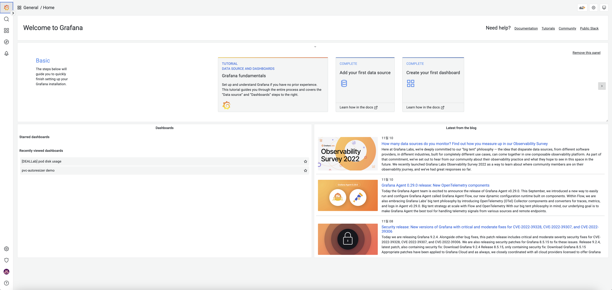
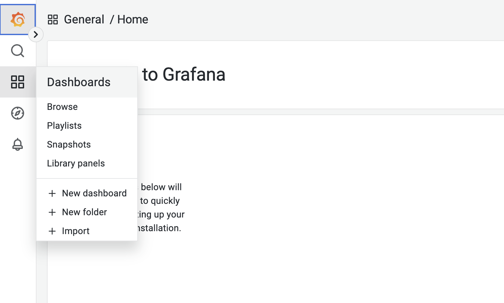
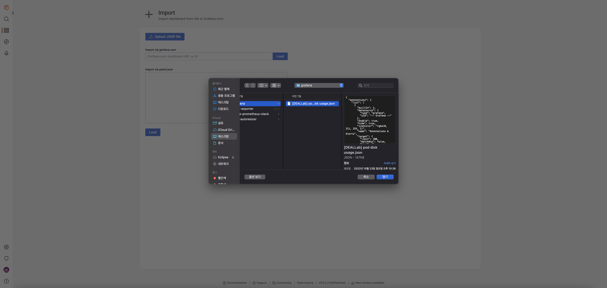
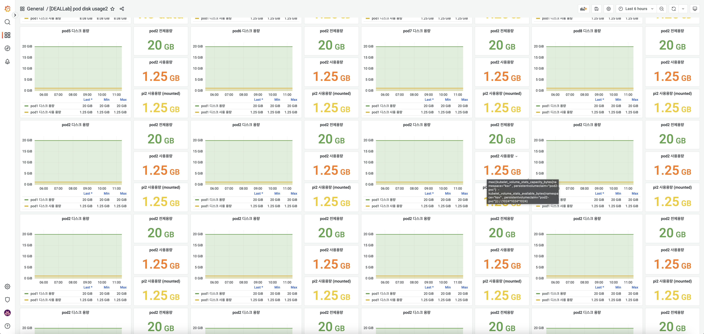

# helm , helm chart 설치 

* kubernetes가 설치되어 있어야함
* 모든 과정은 ksv 네임스페이스에서 이루어 짐


### helm 설치 및 버전 확인
linux ubuntu 20.04 환경에서 설치 
아래의 커맨드로 파일 다운로드 후 스크립트 실행 
```
$ curl -fsSL -o get_helm.sh https://raw.githubusercontent.com/helm/helm/main/scripts/get-helm-3
$ chmod 700 get_helm.sh
$ ./get_helm.sh
```

아래 명령어를 통해 설치됨과 버전을 확인할 수 있음.


```
$ root@master:~$ helm version
version.BuildInfo{Version:"v3.9.2", GitCommit:"1addefbfe665c350f4daf868a9adc5600cc064fd", GitTreeState:"clean", GoVersion:"go1.17.12"}
```

### helm 사용하기

helm에서 chart를 사용하기위해 미리 배포된 repository를 사용하기 위해선 repo를 추가해야 한다. repo add 명령어로 repository를 다운받을 수 있다. 
아래 list 명령어로 실행중인 chart의 리스트를 확인할 수 있다.이 때 namespace를 확인하고 기입해야 한다. 
```
$ helm repo add [NAME] [URL] [flags]
```

list 명령어로 실행중인 chart의 리스트를 확인할 수 있다. 이때 namespace를 확인하고 기입해야 한다. 
```
$ root@master:~$ helm list -A
NAME            NAMESPACE       REVISION        UPDATED                                 STATUS          CHART                            APP VERSION
jsonexporter    ksv             6               2022-11-01 23:06:29.259408297 +0900 KST deployed        prometheus-json-exporter-0.4.0   v0.5.0
prometheus      ksv             4               2022-10-31 20:19:34.776034436 +0900 KST deployed        kube-prometheus-stack-39.11.0    0.58.0
pvc-autoresizer ksv             1               2022-10-24 16:11:48.440464113 +0900 KST deployed        pvc-autoresizer-0.5.0            0.5.0     
```

repository를 사용하기 위해서는 repo add 명령어를 통해 추가할 수 있다. 

```
helm repo add [NAME] [URL] [flags]
```
repository를 추가한 뒤 chart를 installing 하기 위해서는 install 명령어를 사용한다. 

```
helm install [deploy_name] [chart_name]
```

### Prometheus 사용하기

prometheus, prometheus-operator, grafana, node-exporter 등 관련된 프로그램을 일괄적으로 설치할 수 있는 kube-prometheus-stack을 사용해 설치를 진행한다. 

```
$ helm repo add prometheus-community https://prometheus-community.github.io/helm-charts
$ helm repo update
$ cd helm_chart/kube-prometheus-stack
$ helm install prometheus -f prometheus_values.yaml -n ksv prometheus-community/kube-prometheus-stack
```

### Json-exporter 사용하기

json-exporter는 위의 prometheus-community의 repo 내부에 포함이 되어있다. 바로 install 명령어로 설치가 가능하다. 

```
$ cd helm_chart/json-exporter
$ helm install jsonexporter  -f json_exporter_values.yaml -n ksv prometheus-community/prometheus-json-exporter
```
### Json-exporter에서 사용할 API서버 사용하기 (실 디바이스)
* 사용자
* python 3.8 버전 이상 설치
### Pvc-autoresizer 사용하기 

pvc-autoresizer는 따로 repository를 추가해야 한다. 
```
$ helm repo add pvc-autoresizer https://topolvm.github.io/pvc-autoresizer
$ helm repo update
$ cd helm_chart/pvc-autoresizer
$ helm install -n ksv -f pvc_autoresizer_values.yaml pvc-autoresizer pvc-autoresizer/pvc-autoresizer
```
test_pvc의 6~9번 line을 참고하여 resize되는 threshold 값과 증가량을 설정할 수 있다.
```
...
  annotations:
    resize.topolvm.io/threshold: 20%
    resize.topolvm.io/increase: 5Gi
    resize.topolvm.io/inodes-threshold: 0%
...
```

test_storageclass의 6,7번 line을 참고하여 프로메테우스로 metrics를 확인 할 storageclass 설정할 수 있다.

```
...
  annotations:
    resize.topolvm.io/enabled: true
...
```

### Grafana 접속 & 대시보드 적용
그라파나에 접속하기 전 그라파나 서비스의 타입을 확인해야 한다. 
타입이 NodePort일 경우 쿠버네티스 클러스터의 IP와 아래의 예시로 보면 32240번 포트로 접근이 가능하지만 ClusterIP일 경우 이를 NodePort로 변경해야 한다. 
```
$ root@master:~$ kubectl get service -n ksv
...
prometheus-grafana                        NodePort    10.101.233.184   <none>        80:32240/TCP                 25d
prometheus-kube-prometheus-alertmanager   ClusterIP   10.96.31.174     <none>        9093/TCP                     25d
prometheus-kube-prometheus-operator       ClusterIP   10.108.93.187    <none>        443/TCP                      25d
...
```

변경시 helm chart의 values.yaml 파일에서 type을 바꿀 수 있지만 아래의 명령어를 통해서도 변경이 가능하다. 
```
$ kubectl patch svc prometheus-grafana -n ksv -p '{"spec": {"type": "NodePort"}}'
```

초기 로그인 정보인 admin/prom-operator 를 입력하면 아래와 같은 화면이 나온다. 
 
  
   
 
  
좌측 상단의 Dashboards 버튼에서 최하단의 import 버튼을 클릭한다. 



import 화면이 뜨고 upload JSON file 버튼을 클릭 후 [DEALLAB] pod disk usage.json 파일을 열고 적용하면 대시보드를 확인할 수 있다. 이때 메트릭 및 디자인은 커스텀 가능하다.

 
 
