## RPM 서비스 설치
RPM 서비스를 이용하기 위해서는 Go 1.18 버전 및 Node.js 14.18 버전 이상이 필요합니다.
서비스는 Go 1.18 버전 및 Node.js 18.17.1 버전을 이용하여 작성되었습니다.

### Go Download 
https://go.dev/dl/ 


### Go 버전 확인
```
    go version
```
### Node.js Download
https://nodejs.org/en/download


### Node.js 버전 확인
```
    node --version
```


### git clone
git clone으로 리포지토리를 복사해옵니다.
```
    git clone https://github.com/lab-paper-code/ksv.git
```


### 실행 파일 생성
volume-service/ 디렉토리 아래에 실행파일을 만들기 위한 Makefile이 있습니다.
Makefile을 실행하면 환경변수를 자동으로 설정하고 volume-service/bin/ 폴더 아래에 실행 파일(volume-service)을 생성합니다.


### RPM 서비스 실행
volume-service/ 경로에서
```
    ./bin/volume-service -c config.yaml 
    
```
로 서비스를 실행합니다.


### RPM 프론트엔드 설정
volume-service/web/FE 에는 프론트엔드 실행을 위한 파일이 저장되어 있습니다.
FE/admin: admin이 사용할 페이지,
FE/user: user가 사용할 페이지에 대한 파일이 저장되어 있습니다.
vite - svelte 기본 템플릿을 수정하여 admin, user 페이지를 생성합니다.

#### vite - svelte 기본 템플릿 다운로드, Bootstrap 패키지 설치
```
    npm create vite@latest <프론트엔드 폴더 이름> -- --template svelte
```
를 실행하면 다음과 같은 화면을 볼 수 있습니다.
```
    Need to install the following packages:
    create-vite@5.0.0
    Ok to proceed? (y) 
```
y를 입력하여 create-vite 패키지를 설치합니다.
```
    cd <프론트엔드 폴더>
    npm install
    npm install bootstrap
```

이후 <프론트엔드 폴더>로 이동하여 npm install로 추가 패키지를 설치합니다.
프론트엔드 서비스가 bootstrap을 사용하기 때문에 
```
    npm install bootstrap
```
으로 패키지를 설치해줍니다.

#### svelte 템플릿 수정

현재 프론트엔드 디렉토리는 다음과 같습니다.
```
    /<프론트엔드 서버 이름>
    /public
        vite.svg
    /src
        /assets
        /lib
        app.css
        App.svelte
        main.js
        vite-env.d.ts
    .gitignore
    index.html
    jsconfig.json
    package-lock.json
    package.json
    README.md
    svelte.config.js
    vite.config.js

```

이 중 /public 폴더를 삭제하고 /src 폴더 내 파일을 전부 삭제합니다.
그리고 admin 페이지는 FE/admin
user 페이지는 FE/user 내의 모든 파일을 붙여넣습니다.
jsconfig.json 파일에서 "checkJs"를 false로 변경합니다.

최종적인 프론트엔드 디렉토리(admin 페이지 기준)는 다음과 같습니다.
```
    /<프론트엔드 서버 이름>
    /src
        /components
            Navigation.svelte
        /lib
            request.js
        /routes
            /app
                List.svelte
                Register.svelte
            /apprun
                Execute.svelte
                List.svelte
                Terminate.svelte
            /device
                List.svelte
                Register.svelte
                Update.svelte
            /volume
                Create.svelte
                List.svelte
                Mount.svelte
                Unmount.svelte
                Update.svelte
            Home.svelte
        App.svelte
        main.js
        vite-env.d.ts
        .env
        .gitignore
        index.html
        jsconfig.json
        package-lock.json
        package.json
        README.md
        svelte.config.js
        vite.config.js
```

마지막으로
``` 
npm run dev
```
를 통해 프론트엔드 서버를 실행합니다.


### RPM 서비스 설명
RPM 서비스는 크게 4개의 객체(App, AppRun, Device, Volume)에 관한 기능으로 구성되어 있습니다.

#### App 관련 기능
App 객체 기능으로는
1. Register App(admin)
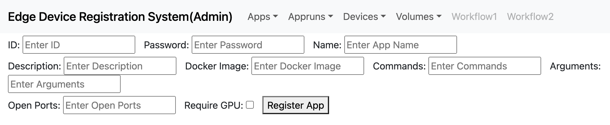
RPM에서 이용할 애플리케이션을 등록합니다.

id, password
: admin 권한을 확인합니다.

Name(필수), Description, Docker_image(필수), Commands, Arguments, Open Ports, Require GPU 
: 애플리케이션 관련 정보입니다.
Docker_image는 애플리케이션 파드 생성 시 이용할 도커 이미지를 입력합니다.
Commands, Arguments는 파드 실행 시 실행할 명령과 인자를 입력합니다.
해당 입력이 없을 경우, 도커 이미지에 정의된 명령을 실행합니다.
Open Ports는 애플리케이션 사용을 위해 외부로 노출할 포트 번호입니다.
Require GPU는 GPU 사용 여부를 확인합니다.

2. Search App(user, admin)
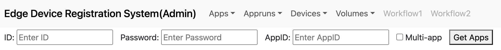
RPM DB에 등록된 App을 검색합니다.
Multi-app을 체크할 경우 등록된 전체 App 목록을 반환합니다.
Multi-app을 체크해제하고, AppID를 입력하면, 특정 App 정보만 반환합니다.


AppRun 객체 기능은
1. Execute AppRun(user, admin)
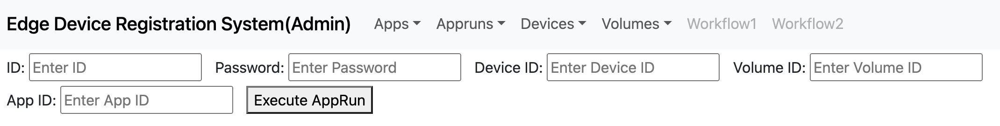
DeviceID, VolumeID, AppID를 입력받아 애플리케이션 파드를 생성합니다.
애플리케이션 파드를 실행하기 위한 리소스(Deployment, Service, Ingress)를 같이 생성합니다.
VolumeID에 해당되는 PV가 애플리케이션 파드에 마운트되어 애플리케이션 실행 시 스토리지로 이용할 수 있습니다.

2. Search AppRun(user, admin)
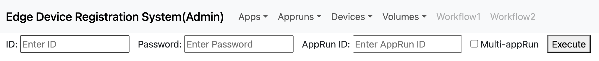
RPM DB에 등록된 AppRun을 검색합니다.
Multi-appRun을 체크할 경우 등록된 전체 AppRun 정보를 반환합니다.
Multi-appRun을 체크해제하고, AppRunID를 입력할 경우 특정 AppRun 정보만 반환합니다.

3. Terminate AppRun(user, admin)
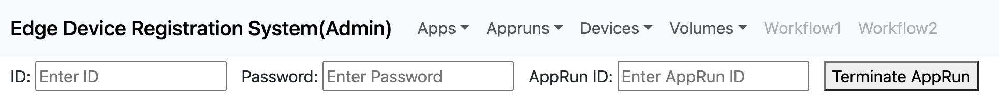
AppRunID를 입력 받아 애플리케이션 파드 리소스를 제거합니다.


Device 객체 기능은
1. Register Device(admin)
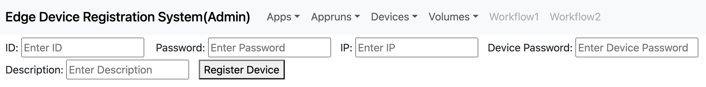
RPM에 실디바이스를 등록합니다.
id, password
: admin 권한을 확인합니다.

IP, Device Password(필수), Description
IP: 실디바이스의 IP를 입력합니다. 데이터를 입력하지 않을 경우, 요청을 보낸 경로의 IP를 자동으로 입력합니다.

Device Password : RPM 기능을 사용하기 위한 Password입니다. 디바이스 등록 후 생성되는 DeviceID와 함께 사용하여 실디바이스를 확인합니다.

2. Search Device(admin)
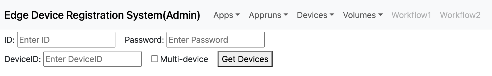
RPM DB에 등록된 Device를 검색합니다.
Multi-Device를 체크할 경우 등록된 전체 Device 정보를 반환합니다.
Multi-Device를 체크해제하고 DeviceID를 입력할 경우 특정 Device 정보만 반환합니다.

3. Update Device(user)
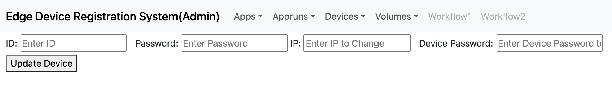
RPM DB에 등록된 Device 정보를 수정합니다.
IP 또는 Device Password를 수정합니다.


Volume 객체 기능은
1. Create Volume(admin, user)
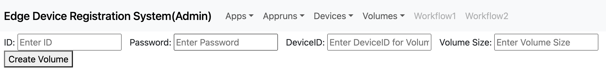
RPM에서 볼륨(PVC)를 생성합니다.
DeviceID: RPM에서는 디바이스 단위로 볼륨을 관리하므로, Device ID를 입력해야 합니다.
Volume Size: 문자열(ex.10gb)로 입력을 받습니다.
kb, mb, gb, tb 까지 입력을 지원하며, 제공하는 최소 볼륨 크기는 1GB 입니다.

2. Search Volume(admin, user)
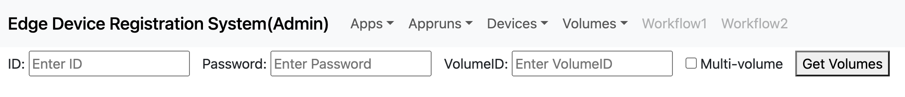
RPM DB에 등록된 Volume을 검색합니다.
Multi-Volume을 체크할 경우 등록된 전체 Volume 정보를 반환합니다.
Multi-Volume을 체크해제하고, 특정 VolumeID를 입력할 경우. 특정 Volume 정보만 반환합니다.

3. Update Volume(admin, user)

RPM DB에 등록된 Volume 정보를 수정합니다.
볼륨 크기를 수정합니다.

4. Delete Volume(admin, user)
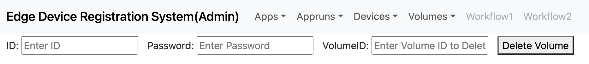
볼륨을 삭제합니다.
볼륨이 마운트 되어 있다면 삭제하지 않고, 마운트 되어 있지 않다면 삭제합니다.

5. Mount Volume(user)
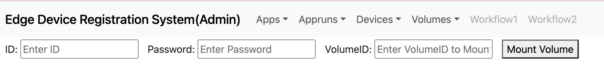
실디바이스에 볼륨을 마운트하기 위한 WebDAV 파드를 생성합니다.
WebDAV 파드를 생성하기 위한 리소스(Deployment, Service, Ingress)를 같이 생성합니다.
WebDAV 파드를 실디바이스의 디렉토리에 마운트할 경우, PV를 가상 스토리지로 이용할 수 있습니다.
(rpm_data_share.md 파일에 예시를 설명하였습니다.)

6. Unmount Volume(user, admin)
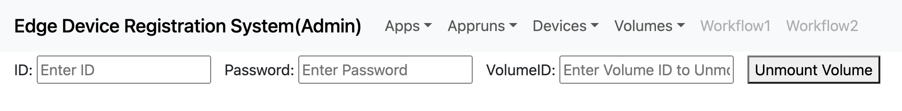
VolumeID를 입력받아 WebDAV 파드 리소스를 제거합니다.
