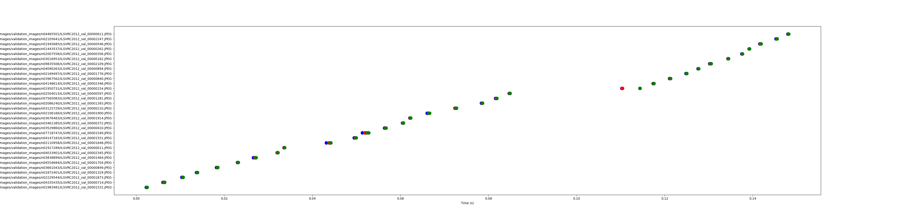

# Analyzing The Data I/O Patterns of ImageNet

* ImageNet 모델 fine-tuning 시, 데이터셋에서 데이터를 읽는 패턴을 확인하고자 함.

## Prerequisite
* Python 3.X
  * 사용한 파이썬 라이브러리는 requirements.txt에 정리
* Strace
* fine-tuning에 사용할 데이터
  * 본 실험에서는 ImageNet이 제공하는 Validation set으로 fine-tuning을 수행함.

## Usage
### 1. Dataset 다운로드
본 실험에서는 [ILSVRC2012](https://image-net.org/challenges/LSVRC/2012/2012-downloads.php) Dataset을 활용한다. 라이센스 상 Dataset Download URL을 공개할 수 없으므로, 수동으로 ImageNet에 회원가입 및 로그인한 뒤, 앞의 URL에서 Download URL을 확인해야 한다.

Dataset Download URL과 같이 `setup.sh`을 실행한다.

```shell
sh setup.sh URL
```

ILSVRC2012에는 1,000개의 카테고리가 있다. `setup.sh`은 다음의 작업을 수행한다.

1. 주어진 URL의 Dataset 다운로드
2. 다운로드한 Dataset 압축 해제
3. Dataset 내의 이미지를 카테고리 별로 분류
4. 각 카테고리 별 이미지를 2개씩만 남김 (해당 작업 이후 이미지 개수는 최대 2,000장이 됨)

### 2. Strace 로그 생성하기
다음과 같은 커맨드로 strace 로그를 생성할 수 있다. 
```shell
sh start_strace.sh <number_of_image> <batch_size> <epoch> <output_file_path>
```
### 3. 로그의 File I/O 연산을 정리한 csv 파일 생성하기
다음의 스크립트를 사용하여 로그에서 File I/O 연산만 모아서 정리할 수 있다.
```shell
python3 strace_log_trimmer.py <strace_log_path>
```
생성된 csv 파일의 내용은 다음과 같다. (예시)

| Time | File Path  | Syscall | Offset |
| ---- | ---------- | ------- | ------ |
| 0.01 | Data1.JPEG | openat  | 0      |
| 0.20 | Data1.JPEG | lseek   | 0      |
| 0.88 | Data1.JPEG | read    | 384759 |
| 1.22 | Data2.JPEG | openat  | 0      |

### 4. 그래프 생성하기
다음의 스크립트를 사용하여 앞서 생성한 형식의 csv 파일을 시각화한다.
```shell
python3 get_chart.py <csv_file_path> <output_file_path>
```
결과 예시는 다음과 같다. `openat()`은 파란색, `lseek()`는 빨간색, `read()`는 녹색으로 표시한다.
