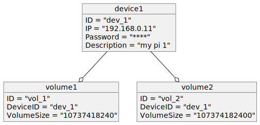

# Volume-Service

Run the service 

```bash
./bin/volume-service -c config.yaml
```

## Object Diagram
<!--
@startuml object
object device1 {
    ID = "dev_1"
    IP = "192.168.0.11"
    Password = "****"
    Description = "my pi 1"
}

object volume1 {
    ID = "vol_1"
	DeviceID = "dev_1"
	VolumeSize = "10737418240"
}

object volume2 {
    ID = "vol_2"
	DeviceID = "dev_1"
	VolumeSize = "107374182400"
}

device1 --o volume1
device1 --o volume2

@enduml
-->

